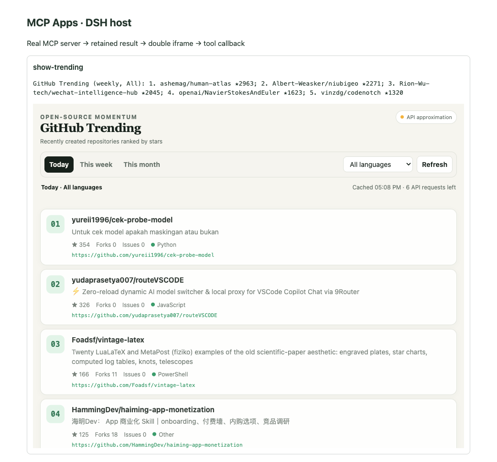
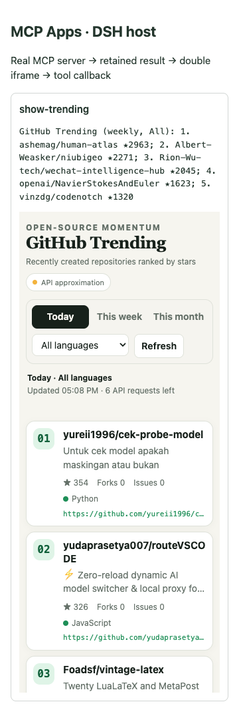

# GitHub Trending MCP App

这是一个本地 stdio MCP Server，通过 GitHub 官方 REST Search API 查询近期新建仓库，并用 MCP App 界面显示排名、语言、stars、forks 和 issues。



移动端布局：



GitHub 没有公开其 `github.com/trending` 排名算法或官方 Trending API。本示例采用可解释的近似算法：筛选最近 1、7 或 30 天创建的非归档、非 fork 公共仓库，再按总 stars 降序排列。因此它适合验证 MCP Apps 链路，但结果不会与 GitHub Trending 网页完全一致。

## 实现组成

| 文件 | 作用 |
| --- | --- |
| `stdio.ts` | 创建 MCP Server 并连接 `StdioServerTransport` |
| `server.ts` | 注册模型入口工具、App 专用工具和 HTML resource |
| `github.ts` | 调用 GitHub REST Search API，完成校验、缓存和错误归一化 |
| `contract.ts` | 定义筛选参数与结构化返回数据 |
| `app.ts` | 接收入口结果，通过 AppBridge 调用 `refresh-trending` |
| `app.html` | 排行榜布局和样式 |

调用路径：

```text
DSH 模型 → show-trending → GitHub API → structuredContent
                                      ↓
聊天卡片 → MCP App → refresh-trending → GitHub API → 更新卡片
```

## 构建和本地验收

```bash
cd /Users/exian/dsh-mcp-apps
npm ci --legacy-peer-deps
npm run build -- --demo
npm run test:trending
```

构建后可执行文件和单文件 UI 位于：

```text
.demo/github-trending/server.js
.demo/github-trending/app.html
```

也可以启动交互式宿主演示：

```bash
node .demo/server.js
```

浏览器访问 `http://127.0.0.1:43187/?app=trending`。

## 配置到 DSH 插件

将以下配置追加到 `wise-mcp-apps` 插件实例的 `config.servers`：

```yaml
- serverName: github-trending
  transport: stdio
  command: /absolute/path/to/node
  args:
    - /absolute/path/to/dsh-mcp-apps/.demo/github-trending/server.js
  env: {}
```

路径必须是 DSH 运行环境内的绝对路径。Docker 部署需要先把 `.demo/github-trending` 复制或挂载到容器可访问的位置。

重启 DSH Web profile 后，让模型调用：

```text
wise_mcp__github-trending__show-trending
```

参数支持：

- `period`: `daily`、`weekly`、`monthly`，默认 `weekly`。
- `language`: UI 支持的语言白名单，默认 `All`。
- `limit`: 5 到 15，默认 10。

UI 内部的筛选和刷新调用 `refresh-trending`。这个工具标记为 `visibility: ['app']`，不会暴露给模型工具列表。

## GitHub API 认证

公开仓库查询可以不配置令牌，但匿名请求限额较低。需要更高限额时，把只读 GitHub Token 作为 MCP Server 环境变量传入：

```yaml
env:
  GITHUB_TOKEN: !!js process.env.GITHUB_TOKEN
```

不要把真实 Token 提交到仓库。服务端只读取 `GITHUB_TOKEN`，不会把它传给 UI、工具结果或错误信息。相同筛选条件会缓存 5 分钟，以减少 Search API 请求。
